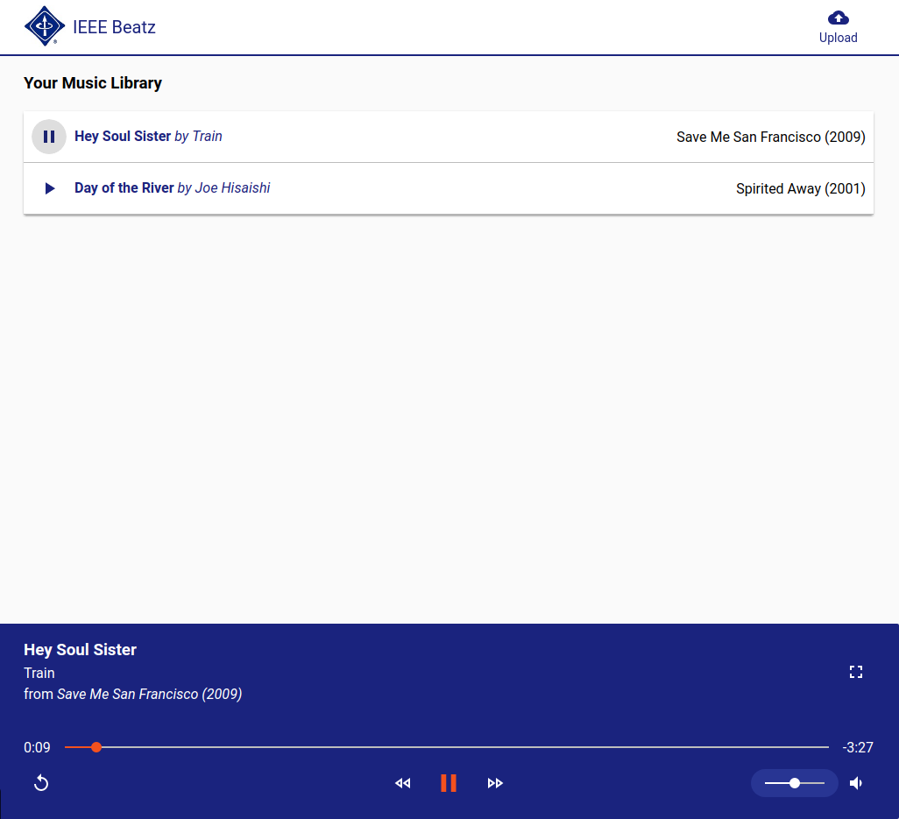

# Web Development Workshop: IEEE Beatz
Your music, your way.

## Requirements
You'll need a few things to get started.

1. A laptop with an internet connection.
2. Something to eat, because learning is best done of a full stomach.

## References

Keep these handy. They contain the documentation required to understand how the project works.

- [Google](http://bfy.tw/DucP): It's really useful. Prefix your searches with the language you're using, such as "html", "css", "js", or "nodejs"
- [Google Polymer Documentation](https://www.polymer-project.org/2.0/docs/devguide/feature-overview): It's a little dense sometimes, but if you're looking for something specific related to Polymer it's probably here.
- [Web Components](https://webcomponents.org): Contains a list of Polymer-compatible elements
- [Mozilla Developer Network (HTML/CSS/JS Documentation)](https://developer.mozilla.org/en-US/): An excellent guide for specific documentation related to the web
- [NodeJS Documentation](https://nodejs.org/dist/latest-v6.x/docs/api/): The official NodeJS documentation, containing all functions that NodeJS can provide
- [StackOverflow](https://stackoverflow.com): If you can't find what you want anywhere else... look here

## Setup and Instructions
Let's get started! Make sure you meet the Requirements above first then continue below.

Go to https://github.com/ieee-utd/ieee-beats/wiki to get started!

## Running the App
You'll need two terminal windows to run the app.

1. Run `node app.js` inside the `api` folder.
2. Run `polymer serve --port 8000` inide the `ui` folder.

Then, go to `localhost:8000` in your web browser. You should see a very basic site!

To verify the API is working, go to `localhost:5000/api` in your web browser.
